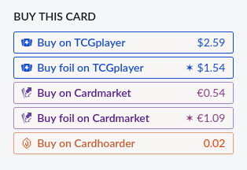
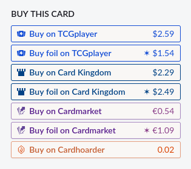
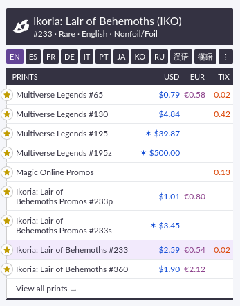
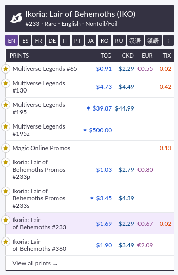

  

# Scry Kingdom

A Firefox/Chrome extension that adds [Card Kingdom](https://www.cardkingdom.com) purchase buttons to [Scryfall](https://scryfall.com) card pages.

## Features

<table align="center">
  <tr>
    <td></td>
    <td></td>
    <td></td>
  </tr>
  <tr>
    <td></td>
    <td align="center">➡</td>
    <td></td>
  </tr>
  <tr>
    <td></td>
    <td align="center">➡</td>
    <td></td>
  </tr>
</table>

- Shows Card Kingdom prices for both regular and foil versions.
- Shows prices inline in the prints section.

## Limitations

- Finds a direct link around 90% of the time.
- If the direct link cannot be found, links to a search on Card Kingdom.
- The incomplete list of conversions from set codes to Card Kingdom URL slugs is the main source of missing links.
